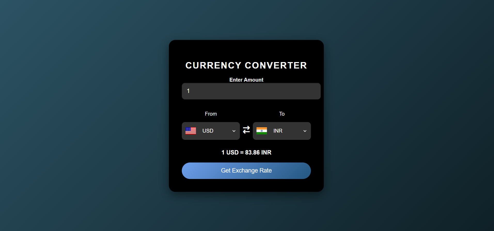

# Currency Converter

This is a simple and responsive Currency Converter web application that allows users to convert one currency to another using real-time exchange rates. The application is designed with a modern UI, utilizing HTML, CSS, and JavaScript.

## Features

- **Real-Time Exchange Rates:** Fetches the latest exchange rates using an API.
- **Responsive Design:** Works on both desktop and mobile devices.
- **User-Friendly Interface:** Simple and intuitive UI with clear instructions.
- **Flag Indicators:** Displays flags of the selected currencies for easy identification.
- **Error Handling:** Graceful error messages if the exchange rate cannot be fetched.

## Screenshots



## Technologies Used

- **HTML5**: For the structure of the web application.
- **CSS3**: For styling the application with a modern and professional look.
- **JavaScript**: For fetching exchange rates and updating the UI dynamically.
- **[Font Awesome](https://fontawesome.com/)**: For the arrow icon used in the currency conversion process.
- **[Exchange Rate API](https://www.exchangerate-api.com/)**: For fetching real-time exchange rates.

## Setup and Usage

1. **Clone the repository:**

   ```bash
   git clone https://github.com/ritikakeshari/currency-converter.git
